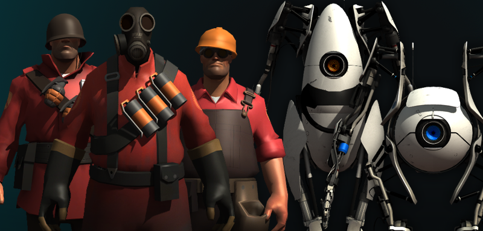

# source-engine-model-loader

Three.js loader for parsing Valve's Source Engine models built by referencing the data structures in the [ValveSoftware/source-sdk-2013](https://github.com/ValveSoftware/source-sdk-2013) project and the source engine [wiki](https://developer.valvesoftware.com/wiki/MDL). Demo models from the [Source Filmmaker](https://store.steampowered.com/app/1840/Source_Filmmaker/) installation.



Get models from [SFMLab](https://SFMLab.com) or [Source Filmmaker](https://store.steampowered.com/app/1840/Source_Filmmaker/).

Demo [here!](https://gkjohnson.github.io/source-engine-model-loader/dist/index.html)

# Lincense Information

Models shown in this repo are not covered by the code license and copyright their respective owners and are for demo purposes only.

# Use

```js
import { SourceModelLoader } from 'source-engine-model-loader';

new SourceModelLoader()
  .load( './folder/model', ( { group } ) => {

    scene.add( group );

  } );
```

# API

## SourceModelLoader

### constructor

```js
constructor( manager : LoadingManager )
```

### load

```js
load(
	url : string,
	onComplete : ( { group : Group } ) => void
) : void
```

Loads the set of Source Engine model files at the given path. It is expected that a model with the extensions `.mdl`, `.vvd`, and `.vtx` exist.

# Unimplemented Features

See [issue #4](https://github.com/gkjohnson/source-engine-model-loader/issues/4) for full list of unimplemented features.
